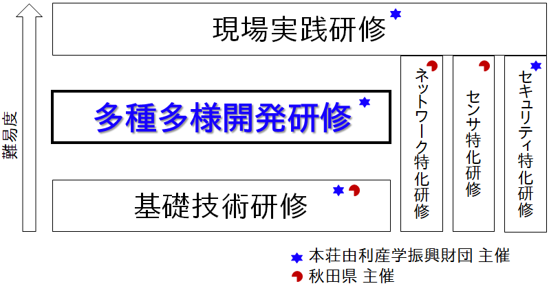

# IoT多種多様開発研修

 2020.2/25,26 

## はじめに
IoTなど先進的な情報通信技術の導入は、人手不足の問題解消や働き方改革に向けた取り組みとして、重要となっています。\
本研修では、多種のセンサなどを用い、多様な課題に対応したIoT機器を製作する手法を学びます。基礎研修から少しステップアップし、実際の課題に対応できる知識や技術の修得を目指します。

## IoT関連の研修について

## 時間割
| |時間|プログラム|
|---|---|---|
|第一日目|9:30~16:30|開発環境のセッティング 、環境計測に関する機器製作、騒音に関する機器制作|
|第二日目|9:30~16:30|スイッチ操作に関する機器制作、人の往来に関する機器製作、まとめ|
|第三日目|時間未定|プレゼンテーションおよび質問など|

## 宿題
- 今回制作したものは、社内などに設置し、後日の報告会にてプレゼンしていただきます。

## セットアップ
本研修では座学でも随時ラズパイ等を操作して確認して頂きます。
まずは準備し起動してください。
Wi-Fiの設定については、正面のホワイトボードをご覧下さい。
- ラズパイ（ラズベリーパイ）のセットアップ（電源はまだ入れない）
- ディスプレイのセットアップ
- ラズパイの電源投入
- デスクトップのアイコンをダブルクリックしてテキストを表示してください
- Wi-Fi接続

[本研修のねらい](./00_introduction)

[製作1 温度](./01_Temperature)

[製作2 音響](./02_ADMP441_ESP32)

[製作3 動力](./03_servo)

[製作4 光検出](./04_PhTr)

[付録 ](./A0_MemoryLeakage)
